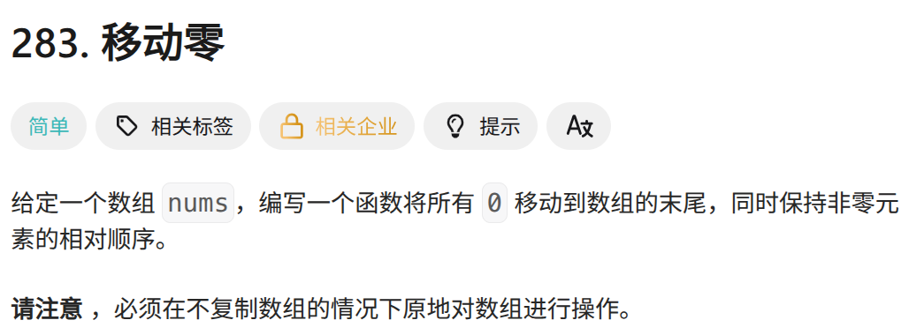
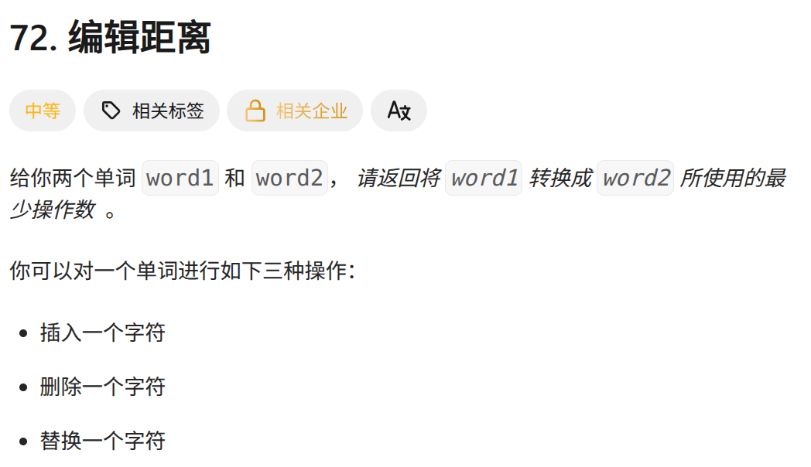

# Leetcode Hot 100 笔记

## 一些技巧

- `Stirng` 转 `int` ：`int a = Interger.parseInt(String b)`

- `ArrayList` 转 普通数组，用流处理：

  ```java
  ArrayList list = new ArrayList<>();
  int[] array = list.stream()
                  .mapToInt(Integer::intValue) // 将 Integer 转换为 int
                  .toArray();
  ```

  

## 1 两数之和--哈希

### 想法一

如果数组有序，则在有序数组中检查两数之和是否为 `target` 只需要 `O(n)` 的时间，具体算法如下：从数组最左侧和最右侧的下标 `i, j` 开始，设 `tmp = nums[i] + num[j]` ，如果 `tmp < target` 则 `++i`，如果 `tmp > target` 则 `--j`，当 `i == j` 时结束，此时未找到满足条件的解。

对数组进行排序需要 `O(nlog(n))` 的时间，可以用 Java 自带的库函数。如下所示：

- 基本数据类型排序：**`Arrays.sort()`** 方法

  ```java
  import java.util.Arrays;
  
  int[] numbers = {1, 5, 3, 2, 4};
  Arrays.sort(numbers);
  
  String[] names = {"John", "Alice", "Bob", "David"};
  Arrays.sort(names);
  System.out.println("排序后: " + Arrays.toString(names));
  // 输出: [Alice, Bob, David, John]
  ```

- 对象数组排序：使用自定义比较器（Camparator）

  ```java
  import java.util.Arrays;
  import java.util.Comparator;
  
  public class ComparatorExample {
      public static void main(String[] args) {
          Person[] people = {
              new Person("John", 25),
              new Person("Alice", 30),
              new Person("Bob", 20)
          };
          
          // 按年龄升序排序
          Arrays.sort(people, new Comparator<Person>() {
              @Override
              public int compare(Person p1, Person p2) {
                  return Integer.compare(p1.age, p2.age);
                  // Integer.compare()，前小于后为负，等于为0,大于为正
              }
          });
          System.out.println("按年龄升序: " + Arrays.toString(people));
          
          // 使用Lambda表达式（Java 8+）
          Arrays.sort(people, (p1, p2) -> p2.name.compareTo(p1.name)); // 按姓名降序
          System.out.println("按姓名降序: " + Arrays.toString(people));
          // compareTo() 方法在处理 string 时是字典序，比较字符的Unicode值，大写在小写前
      } 
  }
  ```

题解如下：

```java
import java.util.Arrays;
class Solution {
    static class Pair {
        int val;
        int pos;
        public Pair(int val, int pos) {
            this.val = val;
            this.pos = pos;
        }

        public static Pair[] getPairs(int[] nums) {
            Pair[] pairs = new Pair[nums.length];
            for (int i = 0; i < nums.length; i++) {
                pairs[i] = new Pair(nums[i], i);
            }
            return pairs;
        }
    }

    public int[] twoSum(int[] nums, int target) {
        Pair[] pairs = Pair.getPairs(nums);
        Arrays.sort(pairs, (p1, p2) -> p1.val - p2.val);

        int i = 0;
        int j = nums.length - 1;
        int[] answer = new int[2];
        int tmp = 0;
        while (i < j) {
            tmp = pairs[i].val + pairs[j].val;
            if (tmp < target) ++i;
            else if (tmp > target) --j;
            else {
                answer[0] = pairs[i].pos;
                answer[1] = pairs[j].pos;
                break;
            }
        }
        return answer;
    }
}
```

### 想法二

不考虑排序，用哈希映射来判断是否有满足条件的值。遍历数组 `nums`，`i` 为当前下标，每个值都判断`map`中是否存在 `target-nums[i]` 的 `key` 值。如果存在则找到了两个值，如果不存在则将当前的 `(nums[i],i)` 存入 map 中，继续遍历直到找到为止。

题解如下：

```java
class Solution {
    public int[] twoSum(int[] nums, int target) {
        HashMap<Integer, Integer> map = new HashMap<>();
        for (int i = 0; i < nums.length; ++i) {
            if (map.containsKey(target - nums[i])) {
                return new int[] {map.get(target - nums[i]), i};
            }
            map.put(nums[i], i);
        }
        return null;
    }
}
```

## 283 移动零--双指针



### 想法一

设置两个指针，第一个指针指向从左往右数第一个 0 ，第二个指针指向第一个指针之后的第一个非零元素，然后进行交换，直到第二个指针超出范围限制。时间复杂度为 `O(n^2)`

题解如下：

```java
public void moveZeroes(int[] nums) {
    int j = 1;
    for (int i = 0; i < nums.length; ++i) {
        if (nums[i] != 0) continue;
        if (j == nums.length) break;
        for (j = j > i + 1 ? j : i + 1; j < nums.length; ++j) {
            if (nums[j] == 0) continue;
            nums[i] = nums[j];
            nums[j++] = 0;
            break;
        }
    }
    System.out.println(Arrays.toString(nums));
}
```

### 想法二

使用双指针，左指针指向当前已经处理好的序列的尾部，右指针指向待处理序列的头部。右指针不断向右移动，每次右指针指向非零数，则将左右指针对应的数交换，同时左指针右移。

注意到以下性质：

- 左指针左边均为非零数
- 右指针左边直到左指针处均为零。

因此每次交换，都是将左指针的零与右指针的非零数交换，且非零数的相对顺序并未改变。

```java
class Solution {
    public void moveZeroes(int[] nums) {
        int n = nums.length, left = 0, right = 0;
        while (right < n) {
            if (nums[right] != 0) {
                swap(nums, left, right);
                left++;
            }
            right++;
        }
    }

    public void swap(int[] nums, int left, int right) {
        int temp = nums[left];
        nums[left] = nums[right];
        nums[right] = temp;
    }
}
```

## 72 编辑距离--动态规划




### 想法一

`dp[i][j]` 表示 `word1` 的前 `i` 个字母转换成 `word2` 的前 `j` 个字母的最少操作数。有如下：

- `dp[0][0] = 0`

- `dp[0][i] = dp[i][0] = i`

- $$
  dp[i][j] = 
  \begin{cases} 
  	dp[i-1][j-1]\ \ \ \ if \ word1[i] == word2[j] \\
  	min(dp[i-1][j],dp[i][j-1],dp[i-1][j-1]) + 1 \ \ \ \  else
  \end{cases}
  $$

  


